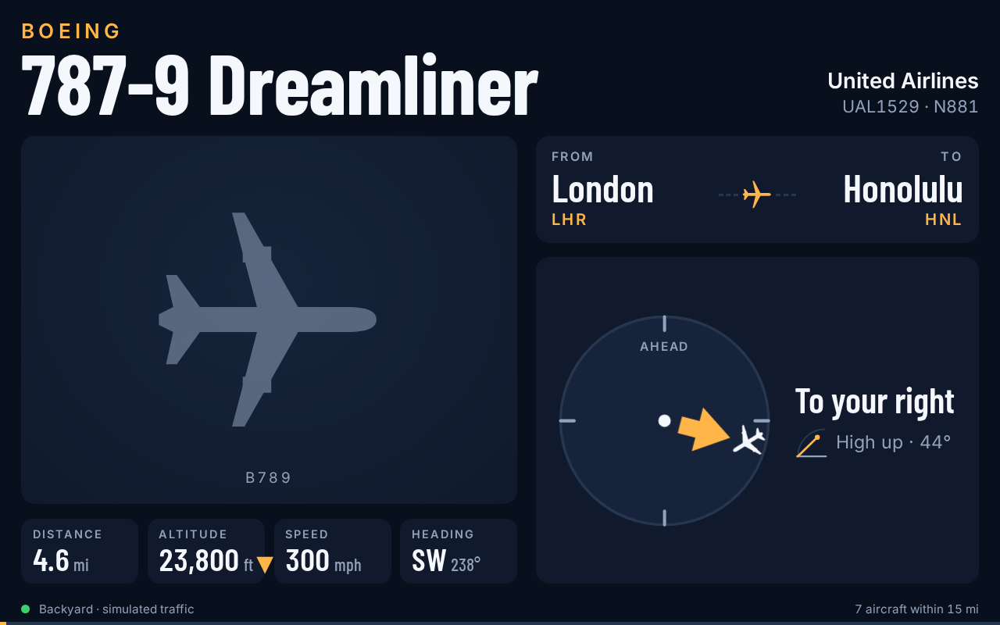
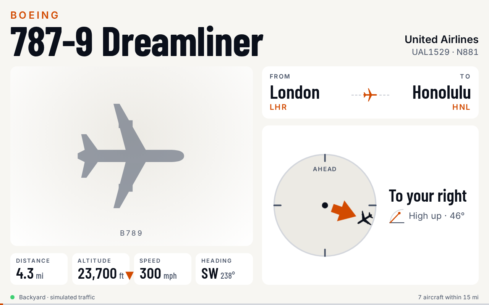
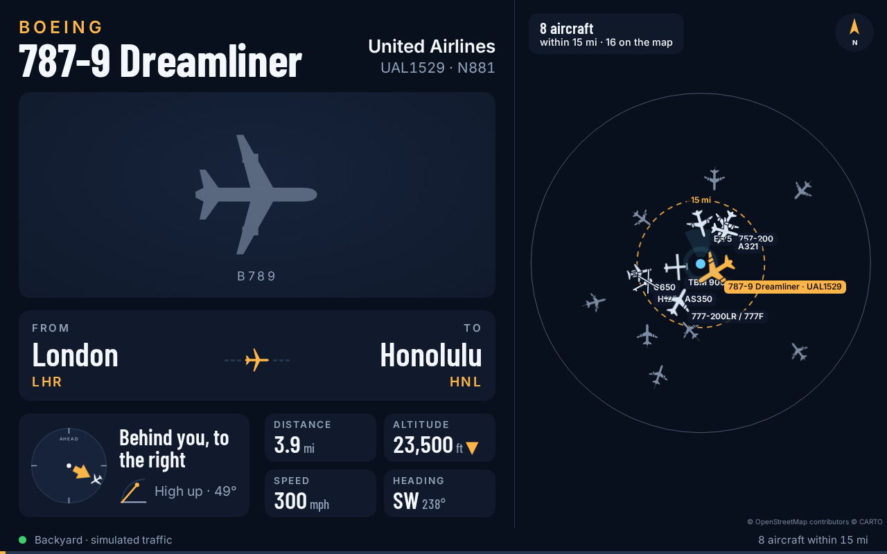
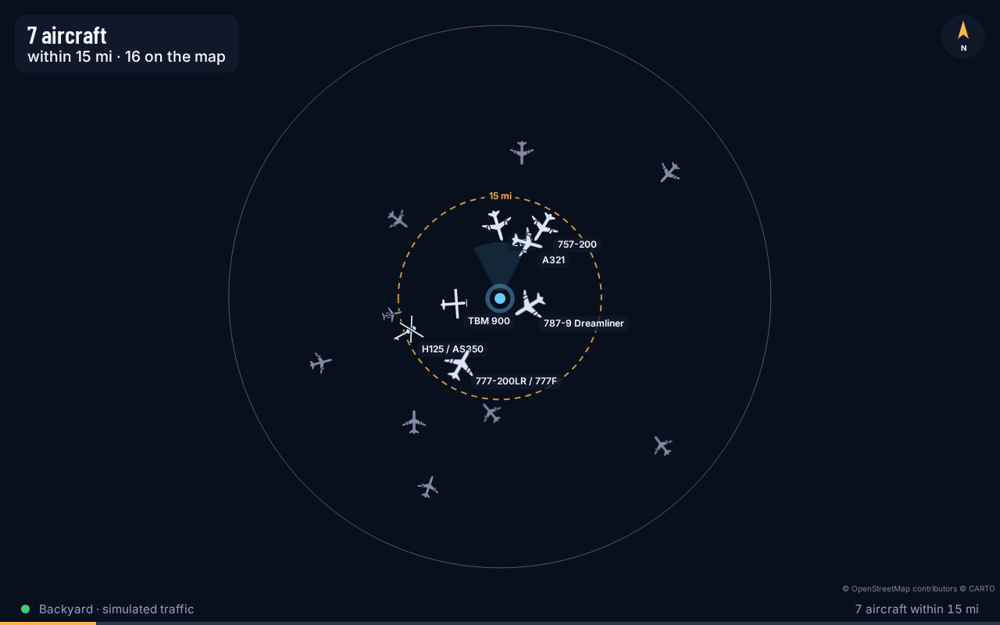
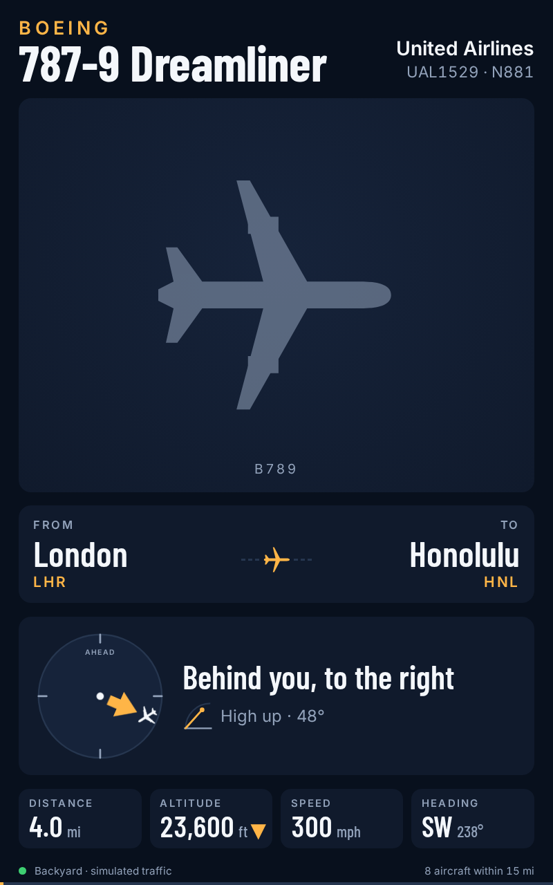
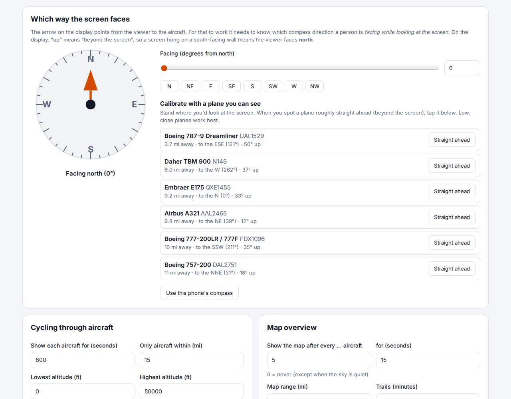

# Look Up: "what plane is that?"

An outdoor display for a home ADS-B receiver. Look up, see a plane, glance at the screen and find out what it is,
where it's going and where to look. It cycles through the aircraft nearby, one at a time:

- **the type**, big enough to read across the garden ("Boeing 737 MAX 8")
- **a photo** of that exact aircraft, or a consistent per-type photo, or a silhouette
- **where it's from and where it's going** (San Francisco → Seattle)
- **an arrow that points at it** from where you stand, plus how high to look ("Ahead, to the left · 32° up")
- **distance, altitude (climbing/descending), speed, heading and typical seats** (or "Cargo" for freight airlines)
- **estimated take-off time, landing time and flight duration**, worked out from the route and the plane's live
  position and speed, each shown in that airport's local time like a timetable ("Lands ≈ 1:50 AM +1")
- **a "Did you know?" fact** about the type — its design, what it can do, or its history — a different one each time
  that type comes round
- a **map overview** every few aircraft, or always alongside in the split layout

A **control panel** sets the cycle time, ranges, altitude filters, the screen's direction (with a "tap the plane you can
see" calibration), the map, units, theme and photo sources.

| Landscape tablet (dark)                    | Daylight theme                          |
| ------------------------------------------ | --------------------------------------- |
|      |  |
| **Split layout (aircraft + map)**          | **Map overview**                        |
|     |            |
| **Portrait**                               | **Control panel: screen direction**     |
|  |   |

_Screenshots use the built-in traffic simulator with no internet access, so silhouettes stand in for photos and the map has
no background tiles._

## How it fits together

```
AirNav FlightStick ─USB─▶ Raspberry Pi 4 ─────────────▶ homelab server ───────────────▶ tablet / screen
                          readsb + tar1090              look-up (this repo)             any browser, full screen
                          serves aircraft.json          polls aircraft.json, adds       /display  (the screen)
                                                        types, routes, photos;          /admin    (control panel)
                                                        pushes updates live (SSE)
```

- **Pi:** decodes ADS-B and serves `aircraft.json`. See **[docs/raspberry-pi.md](docs/raspberry-pi.md)**.
- **Homelab:** runs Look Up (Node.js, Docker-friendly). It enriches each aircraft and streams the list to every open
  display. Its only npm dependencies are Leaflet and two fonts; there is no build step.
- **Display:** a web page. Start with a tablet in full-screen mode; later point a Pi-attached screen at the same URL.

## Quick start

With Docker on the homelab:

```bash
git clone https://github.com/bmclain/look-up.git && cd look-up
mkdir -p data            # so the container (uid 1000) can write its config and caches
docker compose up -d --build
```

Without Docker (Node 20+):

```bash
npm ci
npm start                # http://localhost:8080
```

Then:

1. Open **`http://HOMELAB:8080/admin`**.
2. **Receiver location:** click your house on the map (or type latitude/longitude) and save.
3. **Aircraft data:** it starts on the **Simulator** so you can see the display straight away. When the Pi is ready,
   switch to **My receiver** and enter `http://<pi-ip>/tar1090/data/aircraft.json`. Before the Pi is up you can use
   **Online feed** (adsb.lol) to see real traffic around you.
4. **Which way the screen faces:** see [Aiming the arrow](#aiming-the-arrow).
5. Open **`http://HOMELAB:8080/display`** on the tablet.

On first start the server downloads the open [tar1090 aircraft database](https://github.com/wiedehopf/tar1090-db)
(~8 MB, refreshed weekly) for types, registrations and airline names.

## The display

Each aircraft within the **cycle range** gets a card for _N_ seconds (default 10 s, within 15 mi). The order is
least-recently-shown first, ties going to the closest aircraft, so new arrivals come up quickly and nothing gets
skipped. Every few cards (default 5) the **map** is shown for a while. When nothing is in range the screen shows the
map (or a clock) with the nearest traffic.

- **Tap the right side** (or swipe left, or press →) for the next aircraft. **Tap the left side** (or ←) goes back.
- **Your antenna or the online feed.** With _Also fill in the planes my antenna doesn't hear_ (Settings → Aircraft
  data), each card says _Your antenna_ or _adsb.lol only_, planes only the online feed has are hollow on the map, and
  the footer and Settings show how much of the sky your antenna catches.
- **Tap a plane on the map** for a pop-up with everything on its card and a small photo (its route and photo are looked
  up even if it's far away). _Show full card_ switches to its card; the map stays up while the pop-up is open.
- **Tap anywhere** to bring up controls: hold on this aircraft (space), stay on the map until pressed again (M), light /
  dark / auto (T), full screen (F), settings.
- **Spotlight** (off by default): when an aircraft is very close and low, probably the one you're staring at, the
  display stays on it instead of cycling. Leave it off or keep the radius small if you live under an approach path.
- The theme switches automatically between light (daylight, best in sun) and dark (night), unless you pick one with the
  theme button; each screen remembers its own choice.
- The page reconnects by itself, and reloads itself when the server is restarted or upgraded.

**Per-screen settings.** URL parameters override the saved settings for one screen, which is handy when the tablet and a
Pi screen face different ways:

```
/display?facing=135&layout=split&theme=dark&units=metric
```

### The map

- Each plane is drawn in its airline's colour (the brand colour for airlines listed in `shared/airlines.js`, a steady
  colour of its own for the rest), special aircraft in their kind's colour and private planes in grey, and sized by the
  aircraft, so a light plane is clearly smaller than an airliner.
- Its path covers the last `map.trailMinutes`, thinning towards the old end. The server keeps every plane's track since
  it was first heard (and across restarts), so paths are there as soon as a screen opens.
- The plane on the card gets a thin outline in its colour and its path a soft glow.
- **Tap a plane** and its whole flight since take-off (from adsb.lol) is drawn coloured by altitude: orange near the
  ground through yellow, green and blue to purple at 40,000 ft and up, with a key under the compass. Zoom out to see
  where it came from.
- **Pinch or scroll to zoom, drag to look around**, or use the **+ / −** buttons (double-tap zooms in too). Pinch zoom is
  quicker than one-to-one: fingers twice as far apart zoom 32× closer, on a touchscreen or a laptop trackpad, and the
  mouse wheel zooms two levels a notch, smoothly (`PINCH_GAIN`, `WHEEL_PINCH_RATE` and friends in
  `public/js/map.js`). Gestures on
  the map never skip cards, and the map stays up while you use it. **Re-centre** (or a minute untouched) goes back to
  the usual view. On a map turned to face the viewer (`facing-up`) it zooms about the centre and doesn't drag.
- Labels show the flight number and model, then the airline (or private, police, air ambulance…), altitude and speed.
- The summary in the corner counts the planes per airline, then police, air ambulance, government, military and private.

**Flight numbers.** Planes broadcast an ICAO callsign such as `WJA347`; the display shows the flight number as sold,
`WS347`. Two-letter airline codes come from `shared/airlines.js` (regional airlines such as WestJet Encore use their
brand's code) or, for other airlines, adsbdb. Callsigns that aren't a plain number (`ASA12B`) and military or other
special flights keep their callsign.

**The whole flight.** The card's mini map draws the flight since take-off from [adsb.lol](https://adsb.lol)'s open data
(ODbL) where it has it, joined to your own receiver's track.

### Aiming the arrow

The arrow points from the viewer to the aircraft. Straight up on the dial means **beyond the screen**: the direction a
person faces while looking at it. The display needs that compass direction, so set it in the control panel:

- **Dial / presets:** a screen hung on a south-facing wall means you face **north** to read it.
- **Calibrate with a plane you can see** (the easiest way): stand at the screen, spot a plane roughly straight ahead,
  and tap **Straight ahead** next to it in the list. Its bearing becomes the facing direction.
- **Phone compass:** works where the browser allows it (HTTPS pages only on iPhone).

The **map** can also be rotated so that the way you face is up (`Map orientation`), which makes it match the sky.

### Tablet tips

- **Android:** [Fully Kiosk Browser](https://www.fully-kiosk.com/) works over plain `http://`. Set _Web Content
  Settings → Start URL_ to `http://HOMELAB:8080/display`; for full screen turn off _Toolbars and Appearance → Show
  Status Bar_ and _Show Navigation Bar_; and turn on _Device Management → Keep Screen On_ and _Launch on Boot_. These are
  all free (locking the tablet to the page is a paid PLUS feature). Chrome only installs the display as a full-screen
  app over **HTTPS**: over plain `http://`, _Add to Home screen_ just adds a bookmark that opens in a browser tab.
- **iPad:** Safari → _Share → Add to Home Screen_ opens it full-screen. Set _Auto-Lock: Never_ and use _Guided
  Access_ to keep it on the page.
- Browsers only allow the "keep screen awake" API on HTTPS, so over plain `http://` on your LAN rely on the tablet's own
  stay-awake setting or a kiosk app. Putting Look Up behind your existing HTTPS reverse proxy also works, but put a
  password in front of it: the display shows where you live, and `/admin` is open unless `ADMIN_PASSWORD` is set. Don't
  rely on an IP allowlist alone: many routers make forwarded connections from the internet look like they come from
  the router's own LAN address.
- The display needs a reasonably modern browser (it uses CSS container queries: Chrome/Android WebView 105+,
  Safari/iPadOS 16+).

## Photos

Choose in **Photos & routes**:

| Mode                          | What you get                                                                                                                                                      |
| ----------------------------- | ----------------------------------------------------------------------------------------------------------------------------------------------------------------- |
| **Actual aircraft** (default) | A photo of that exact airframe in its livery from [planespotters.net](https://www.planespotters.net), credited to the photographer. Falls back to the type photo. |
| **One photo per type**        | A consistent library: the lead image of each type's Wikipedia article (Wikimedia Commons, freely licensed), downloaded once.                                      |
| **Silhouettes only**          | No network lookups.                                                                                                                                               |

**Your own library always wins.** Put images in the data directory:

```
data/images/types/B38M.jpg          # by ICAO type designator
data/images/airframes/N12345.jpg    # by registration…
data/images/airframes/a1b2c3.jpg    # …or by ICAO hex
```

New files are picked up within a minute, so you can build a matching set (same angle, same background, whatever you like)
over time. To pre-fill the Wikipedia library for ~230 common types in one go:

```bash
npm run fetch-images                   # or: docker compose exec look-up npm run fetch-images
npm run fetch-images -- B38M A21N      # just some types
```

Credits (photographer / Commons author and licence) are shown on the photo.

## Routes

Origin and destination come from the free community route database at [adsb.im](https://adsb.im) (the same data
tar1090 shows), batched, with [adsbdb.com](https://www.adsbdb.com) as a fallback (it also supplies airline names and
IATA flight numbers). Results are cached for 12 hours. These databases are crowd-sourced and occasionally out of date,
and airlines reuse flight numbers, so by default a route is hidden when it plainly doesn't match where the plane is.
Private, charter and general-aviation flights usually have no published route. (adsb.lol serves the same API but
currently answers with an empty response; it's still selectable.)

**Times are estimates.** The free databases have no schedules, so take-off and landing times are calculated from the
distance flown and remaining at the aircraft's speed (typical cruise speed for the part we didn't see). Landing times
are usually within about 15 minutes; take-off times are rougher. Exact times would need a paid flight-status API such
as FlightAware AeroAPI. Each time is in the local time of its airport (the time zone is looked up offline from the
airport's position), with "+1" when the plane lands on a later local date than it took off.

**Type facts** live in `shared/type-facts.js`, grouped by family with extra ones for particular variants. Every type in
the curated table has at least one; add your own for the types you see most.

### FlightAware (optional, paid per query)

With a FlightAware [AeroAPI](https://www.flightaware.com/commercial/aeroapi/) key in `FLIGHTAWARE_API_KEY`, flights the
free sources can't place get their route from FlightAware, with the real take-off time ("Took off 1:15 PM", no ≈) and
FlightAware's landing estimate and delay. Business jets and turboprops are looked up by registration, since they often
fly filed flight plans. When you tap a plane on the map and adsb.lol hasn't got the start of its flight, the start of
the path comes from FlightAware too.

AeroAPI charges per query ($0.005 for a flight, $0.012 for a flight path); the Personal plan waives the first $5 a
month ($10 for ADS-B feeders). So Look Up is strict about it:

- it asks only about planes in the air near you that adsb.im and adsbdb couldn't place (or placed wrongly), never about
  light aircraft or helicopters, and never with the simulator;
- every query is booked in `data/cache/flightaware-ledger.json` **before** it's sent, and refused once the month's
  budget (Settings → FlightAware, default $4, at most $10) is used; the budget is spread evenly over the days left in
  the month, so a busy afternoon can't use it all;
- at most 6 queries a minute (FlightAware allows 10), one page per query (`max_pages=1`, a narrow time window, "next"
  links never followed), and answers are cached for hours;
- FlightAware's own usage figure (free to ask for) is checked hourly and used if it's higher than ours, e.g. when the
  key is also used elsewhere. It can lag by a day, so the ledger is what keeps you inside the budget.

Settings → Status shows what's been spent this month and today.

## Special aircraft

Police, air ambulance, firefighting, search & rescue, military and government aircraft get a coloured badge on the card,
the pop-up, the map and the traffic page. Many are recognised automatically from the aircraft database (its military flag
and the operator's name). Add your own under **Settings → Special aircraft** by registration (`C-FSPS`), callsign or hex
code (`STAR*` matches callsigns starting with STAR), and tick **Alert** to show a notice in the top corner of the display
whenever that aircraft is in range. Emergency squawks (7500, 7600, 7700) always show a notice.

## Receiver health

**Settings → Receiver health** checks how well your own ADS-B receiver is doing, from readsb's `stats.json` and 24-hour
range outline on the Pi (it needs _My receiver_ as the aircraft source, with an `…/data/aircraft.json` URL). It gives a
verdict (also shown on the Overview tab) and plain-English checks — overload, signal above the noise, gain maxed out,
dropped samples, tuning error, the furthest plane heard — and, with the online fill-in turned on, what share of the
planes adsb.lol sees your antenna hears at each distance, which is the clearest test of an antenna or its cable.
Charts: range by direction with today's planes heard and missed, signal strength against distance, and the last 48
hours (kept in `data/cache/rf-history.json`). It links to the Pi's own graphs1090 for longer history.

## Your local airport

Set **Settings → Daily traffic → Local airport** (code, position and elevation) and the traffic page shows where its
departures go and where its arrivals come from, as shares of each day or the last 30 days. A flight counts when it's seen
low near the airport (by default lower than 5,000 ft above it, within 30 km); its far end comes from its route. Flights
that came low near the airport although their route doesn't use it, such as diversions, are listed separately.

## Air traffic control audio

Look Up can listen to the local tower and ground frequencies, work out which plane each call is to or from, and show
what's happening on that plane's card in plain words ("Cleared to land on runway 27"), playing its recent calls as the
card comes up. A pulsing **On the radio** panel replaces the type fact while a plane has been heard in the last 10
minutes. Each screen can mute itself with its 🔊 button (or `?sound=off`).

How it works: audio is split into separate calls where the squelch closes between them (a fifth of a second of
silence; pauses in speech keep their radio hiss), each call is transcribed by
[whisper.cpp](https://github.com/ggml-org/whisper.cpp) (primed with the callsigns of the planes nearby, which makes a big
difference), and the callsign is matched against the aircraft being tracked: "WestJet three forty-seven" is WJA347,
"Cessna Alpha Romeo Charlie" is C-FARC, "Riser 193" is RS193 (a flight number alone counts when only one plane nearby
has it), and "Westjet 63" is WJA603 when no other WestJet nearby is one digit off. Calls with no recognisable callsign are kept in the admin page's _Heard lately_
list but not shown on cards. With `ANTHROPIC_API_KEY` set, Claude (Haiku 5.5) writes the one-line summary from the
plane's last few calls and its altitude and speed; without it, a built-in phrase list is used. A summary costs about
$0.0003; they're only written for planes close enough to get a card, at most 30 an hour, out of a hard monthly budget
(default $2, spread over the days left; Settings → ATC audio).

**What to expect.** Tested on a real 35-minute CYXE Ground/Tower recording (243 calls): the large model hears about
twice as many callsigns as `small.en`, but plenty still come out garbled, and much of the traffic at a training airport
is small planes in the circuit that don't broadcast ADS-B, so there's no plane on the display to match them to. Calls
with airliners, charters and anything with ADS-B are the ones that land on cards.

**Set up**

1. Start the speech-to-text service: `docker compose up -d whisper` (see `docker-compose.yml`). It's built from source
   so it runs on older CPUs without AVX2 and on the Raspberry Pi; the first start downloads the `large-v3-turbo-q5_0`
   model (about 570 MB). It takes about 8 s a call on 16 older Xeon cores, which keeps up with a busy tower; on a slower
   machine set `WHISPER_MODEL: small.en` and remove `WHISPER_ARGS` (3× faster, about half as many callsigns heard).
2. Optionally add `ANTHROPIC_API_KEY` to the `look-up` service's environment for the Claude summaries.
3. In `/admin` → **ATC audio**, tick _Listen_, set the local facility name (e.g. `Saskatoon`), and pick
   where the audio comes from.

**Where the audio comes from**

- **Your own receiver (best).** A second RTL-SDR dongle with an airband antenna (118–137 MHz) and
  [rtl_airband](https://github.com/rtl-airband/RTLSDR-Airband). Have it write one file per call into the inbox folder:

  ```
  devices: ({
    type = "rtlsdr"; index = 1; gain = 35;
    centerfreq = 119.1;            # one dongle covers ~2 MHz: here 118.3 tower + 119.9 departure
    channels: (
      { freq = 118.3; outputs: ({ type = "file"; directory = "/srv/look-up/data/atc/inbox";
                                  filename_template = "yxe-twr"; split_on_transmission = true; }); },
      { freq = 119.9; outputs: ({ type = "file"; directory = "/srv/look-up/data/atc/inbox";
                                  filename_template = "yxe-dep"; split_on_transmission = true; }); }
    );
  });
  ```

  If the receiver runs on another machine (the Pi), use its Icecast output instead and set the source to _A live audio
  stream_ with the Icecast URL; the calls are split out of the stream.

- **Recordings.** Any audio file dropped into `data/atc/inbox` (MP3, WAV, M4A, OGG, FLAC) is split into calls,
  transcribed and moved to `done/`. Handy for trying it out. A call is timed from when the file was written, so an old
  recording is treated as if it just happened, and its callsigns only match planes that are around now.

- **Online feeds.** LiveATC carries CYXE tower and ground, but its terms don't allow other apps to pull its streams
  without permission, and its servers block automated access. Ask LiveATC before pointing Look Up at one of its feeds.

## Map background

OpenStreetMap's volunteer-run tile servers block apps like this, and CARTO now watermarks tiles requested without a
key. Use a provider with a free key:

1. **Stadia Maps** (recommended, free for non-commercial use): sign up at <https://client.stadiamaps.com/signup/>,
   create a _property_, and copy its API key.
2. Or **MapTiler**: sign up at <https://cloud.maptiler.com/> and copy a key from _API keys_.
3. Or **CARTO**: request a key at <https://carto.com/basemaps/apikey/> (no account needed; it arrives by email).
4. In `/admin` → **Map overview** → _Background map_, choose the provider, paste the key into **Map API key**, and Save.

The key travels with every map image the tablet downloads, so treat it as public (all three providers let you restrict
a key to your own domains). Without a key the map simply has no background. Without internet, choose _None_.

## Configuration

Everything is editable in `/admin` and stored in `data/config.json`. Changes reach open displays immediately.

| Setting                                  | Default                                               | Notes                                                                                                                             |
| ---------------------------------------- | ----------------------------------------------------- | --------------------------------------------------------------------------------------------------------------------------------- |
| `receiver.lat/lon/altitudeM`             | Seattle                                               | Where the antenna and screen are. Altitude is ground elevation, used for "look up" angles.                                        |
| `source.type`                            | `simulator`                                           | `aircraft-json` (your Pi), `adsb-api` (online), `simulator`                                                                       |
| `source.url`                             | `http://raspberrypi.local/tar1090/data/aircraft.json` | readsb / dump1090-fa / tar1090 `aircraft.json`                                                                                    |
| `source.apiUrl`                          | adsb.lol `/v2/point/{lat}/{lon}/{radiusNm}`           | any readsb-style API                                                                                                              |
| `source.supplement`                      | off                                                   | with your receiver: also fill in the planes it doesn't hear from `apiUrl`; each plane is marked _Your antenna_ or _adsb.lol only_ |
| `source.onlineSeconds`                   | 10                                                    | how often to ask the online feed (at least 5; adsb.lol refuses faster)                                                            |
| `display.cycleSeconds`                   | 10                                                    | time per aircraft                                                                                                                 |
| `display.cycleRangeKm`                   | 24.14 (15 mi)                                         | only aircraft this close are cycled through                                                                                       |
| `display.min/maxAltitudeFt`              | 0 / 50,000                                            | e.g. skip high overflights you can't see                                                                                          |
| `display.hideGround`                     | true                                                  |                                                                                                                                   |
| `display.spotlight.*`                    | off, 2 mi, below 8,000 ft                             | stick to very close aircraft                                                                                                      |
| `display.facingDeg`                      | 0                                                     | compass direction you face while looking at the screen                                                                            |
| `display.units`                          | `imperial`                                            | `imperial` (mi, mph), `aviation` (nm, kt), `metric`                                                                               |
| `display.theme`                          | `auto`                                                | `auto` follows sunrise/sunset at the receiver                                                                                     |
| `display.layout`                         | `card`                                                | `card` (map in between) or `split` (map always alongside)                                                                         |
| `map.everyCards` / `map.seconds`         | 5 / 15                                                | 0 = never interleave the map                                                                                                      |
| `map.rangeKm`                            | 64.37 (40 mi)                                         | aircraft shown on the map                                                                                                         |
| `map.orientation`                        | `north-up`                                            | or `facing-up`                                                                                                                    |
| `map.trailMinutes`                       | 30                                                    | how much of each plane's path to draw (0 = none, up to 180)                                                                       |
| `map.tiles` / `map.tileApiKey`           | `stadia` / empty                                      | `stadia`, `maptiler` or `carto` (free key needed), `osm`, `none` (offline), `custom`                                              |
| `enrichment.photoMode`                   | `airframe`                                            | `airframe`, `type`, `off`                                                                                                         |
| `enrichment.routes` / `routeProviders`   | on / adsb.im, adsbdb                                  |                                                                                                                                   |
| `enrichment.flightTracks`                | on                                                    | whole flight since take-off on the mini map, from adsb.lol                                                                        |
| `flightaware.monthlyBudgetUsd`           | 4                                                     | hard monthly cap for AeroAPI queries (0–10; needs `FLIGHTAWARE_API_KEY`)                                                          |
| `flightaware.perMinute`                  | 6                                                     | queries a minute (1–8)                                                                                                            |
| `flightaware.generalAviation` / `tracks` | on / on                                               | look up business jets and turboprops; fill in a tapped plane's flight path                                                        |
| `atc.enabled`                            | off                                                   | listen to air traffic control (see above)                                                                                         |
| `atc.source`                             | `folder`                                              | `folder` (files in `atc.folder`, default `data/atc/inbox`) or `stream` (`atc.streamUrl`)                                          |
| `atc.whisperUrl`                         | `http://whisper:8080`                                 | the whisper.cpp server                                                                                                            |
| `atc.facility`                           | empty                                                 | local facility name as said on the radio ("Saskatoon")                                                                            |
| `atc.summaries` / `atc.playAudio`        | on / on                                               | Claude summaries (with `ANTHROPIC_API_KEY`); play calls on the card                                                               |
| `atc.recentMinutes` / `keepMinutes`      | 10 / 60                                               | how recent a call must be to show on a card; how long audio is kept                                                               |

Environment variables: `PORT` (8080), `DATA_DIR` (`./data`), `ADMIN_PASSWORD` (if set, needed to change settings),
`FLIGHTAWARE_API_KEY` (AeroAPI, see above), `ANTHROPIC_API_KEY` (Claude summaries of air traffic control calls), and
first-run seeds `RECEIVER_LAT`, `RECEIVER_LON`, `RECEIVER_ALT_M`, `SOURCE_URL` (ignored once `config.json` exists).

## API

| Endpoint                       | Purpose                                                                        |
| ------------------------------ | ------------------------------------------------------------------------------ |
| `GET /api/stream`              | Server-Sent Events: `hello`, then `aircraft` every second, `config` on change  |
| `GET /api/aircraft`            | enriched aircraft in range, nearest first (`?trails` for position history)     |
| `GET /api/aircraft/:hex/track` | the flight since take-off (adsb.lol) for an aircraft being tracked             |
| `GET /api/aircraft/:hex/radio` | its air traffic control calls lately, with transcripts and audio               |
| `GET /api/rf`                  | receiver health: checks, verdict, coverage, range outline, 48-hour history     |
| `GET /api/atc/recent`          | the last 50 calls heard, matched or not                                        |
| `GET /api/config` / `PUT`      | read / update settings (PUT accepts partial objects; 400 lists invalid fields) |
| `GET /api/status`              | receiver feed, databases, lookup caches, connected displays                    |
| `POST /api/source/test`        | try a source config once, without saving it                                    |

## Development

```bash
npm run dev      # restart on changes
npm test         # unit + API tests (node:test, no network needed)
```

Layout: `server/` (sources, tracker, enrichment, air traffic control in `server/atc/`, HTTP), `shared/` (geometry, units and cycling logic used by both server
and browser), `public/` (display and control panel, plain ES modules), `test/`.

## Credits

- Aircraft, type and operator data: [tar1090-db](https://github.com/wiedehopf/tar1090-db) by wiedehopf.
- Routes: [adsb.im](https://adsb.im) and [adsbdb](https://www.adsbdb.com).
- Photos: [planespotters.net](https://www.planespotters.net) photographers and Wikimedia Commons contributors (credited on
  screen).
- Map: [Leaflet](https://leafletjs.com), © [OpenStreetMap](https://www.openstreetmap.org/copyright) contributors, © CARTO.
